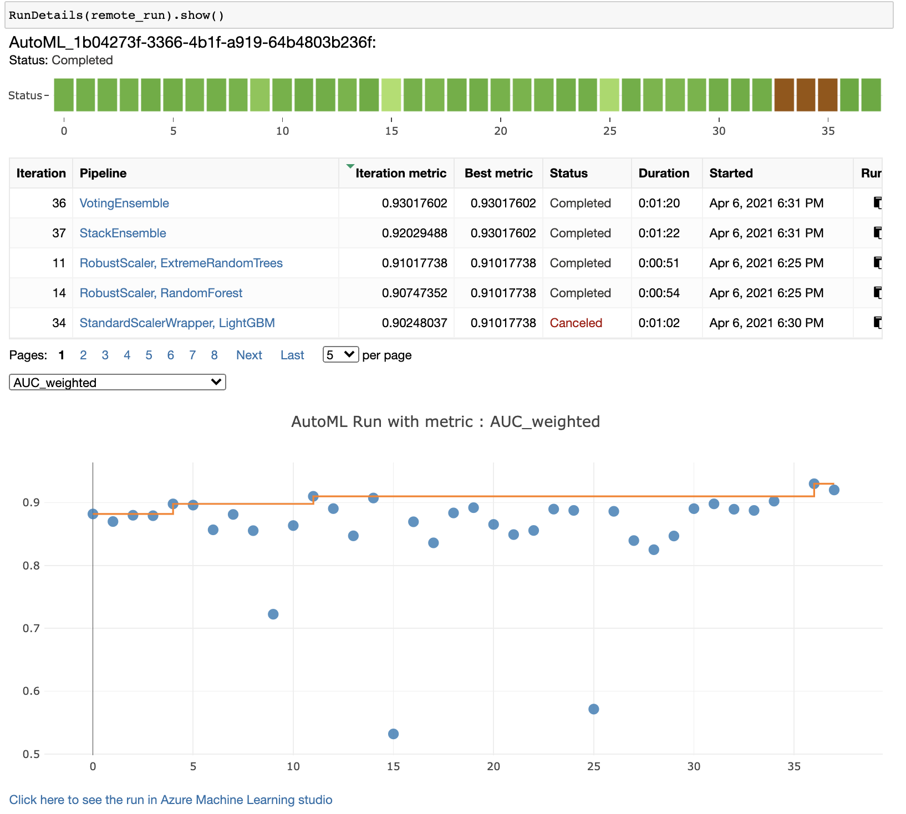
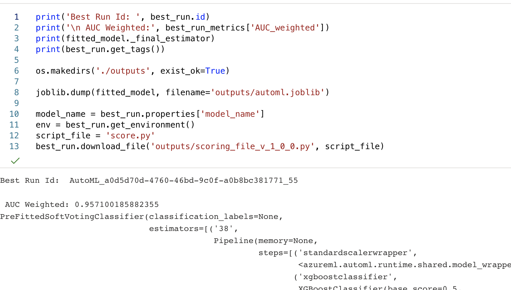
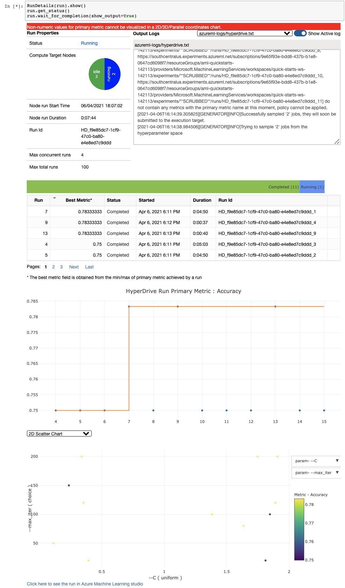

# Predicting Heart Failure

Cardiovascular diseases are behind the death of approximately 18 million people every year. They mainly exhibit as myocardial infarctions and heart failures. Heart failure (HF) occurs when the heart cannot pump enough blood to meet the needs of the body.

If Heart Failure could be predicted with relatively high accuracy, the patient could receive preventive treatment before the actual event happens. In this project, we have used Azure ML for training several predictive models to achieve the desired target.

## Dataset

### Overview
The dataset we are using was obtained from the publication "Machine learning can predict survival of patients with heart failure from serum creatinine and ejection fraction alone". Davide Chicco, Giuseppe Jurman. BMC Medical Informatics and Decision Making 20, 16 (2020). ([link](https://doi.org/10.1186/s12911-020-1023-5))

The dataset contains the medical records of 299 heart failure patients collected at the Faisalabad Institute of Cardiology and at the Allied Hospital in Faisalabad (Punjab, Pakistan), during April–December 2015. The patients consisted of 105 women and 194 men, and their ages range between 40 and 95 years old. All 299 patients had left ventricular systolic dysfunction and
had previous heart failures that put them in classes III or IV of New York Heart Association (NYHA) classification of the stages of heart failure.

### Task
In the dataset we can find 12 features that can be used to predict heart failure mortality:
* age
* anemia (Decrease of red blood cells or hemoglobin
* creatinine_phosphokinase (Level of the CPK enzyme in the blood)
* diabetes (If the patient has diabetes)
* ejection_fraction (Percentage of blood leaving the heart at each contraction)
* high_blood_pressure (If the patient has hypertension)
* platelets (Platelets in the blood measured in kiloplatelets/mL)
* serum_creatinine (Level of serum creatinine in the blood measured in mg/dL)
* serum_sodium (Level of serum sodium in the blood measured in mEq/L)
* sex (Woman or man)
* smoking (If the patient smokes or not)
* time (Follow-up period in days)
* DEATH_EVENT (If the patient deceased during the follow-up period)

The target variable is DEATH_EVENT.

We are going to train a Machine Learning model by using AutoML in Azure ML and HyperDrive with a Logistic Regression algorithm. In both cases, we want to predict the death of a patient based on the features available in the dataset. In the next picture we can see an overview of the training setup.

Once we have a best model trained, we will deploy it into a web Endpoint and will test its REST API.

As we will later see, AutoML can significantly reduce the effort invested by Machine Learning Engineers to find fitting models. In our case, AutoML found a better model than HyperDrive with our own algorithm.

## Introduction to Azure Machine Learning
Azure Machine Learning (ML) is a fully managed service from the Microsoft Azure cloud. It includes a wide variety to tools to simplify the ML Operations (MLOps):
- Experiments: Here we can find the different runs and child-runs organized in Experiments
- Notebooks: Similar to Jupyter Notebooks
- Designer: A graphical UI to connect boxes with different steps of the ML pipeline
- Compute: Compute Instances for Notebooks, Compute Clusters for training, Inference Clusters and Attached Compute can be managed from this section
- Models: Azure ML allows you to keep a Model registry with metadata related to each model
- Endpoints: This is the easiest way to deploy a REST API with the model of your choice to do inferences
- Datasets: We can load datasets to Azure ML via different methods, for example, uploading a file
- Datastores: This makes logical references to DataBases and other sources of data

Part of the Azure ML is the Python SDK. This includes very interesting features to abstract some of the most complex operations of Machine Learning Engineers. Particularly useful are AutoML and HyperDrive.

### Introduction to AutoML

During the last decade, hundreds of thousands of hours of very skilled (and expensive) Machine Learning Engineers have been employed in fine tuning the model search for ML problems. This has been mainly done through trial and error. However, during the last couple of years, a tendency to automate this process has emerged with the name of Automated Machine Learning.

AutoML in Azure ML is a tool (both programmatic through the Python SDK and with the UI in the Azure ML Web portal) which allows to automate the search for the right algorithm for a defined problem and dataset. AutoML supports classification, regression and forecast problems. From the defined metric as being the target to optimize, AutoML finds the best combination of algorithm and hyperparameters without additional effort.

### Introduction to HyperDrive
Hyperparameters are those parameters which are manually configured (selected) by the Machine Learning Enginner, instead of learned by the Machine Learning algorithm. This includes the number of epochs, the learning rate, regularization factors and many others, depending on the algorithm selected. 

HyperDrive is the tool from Azure ML to facilitate the HyperParameter Optimization (HPO). Different options are provided, including the Search Space (Sampling), Early Termination policy and others.

### Access
We are adding the dataset to AzureML by importing the CSV file, which we obtained from the original source. We need to select during the importing step "tabular" and to use the first row as the columns name. The rest of the schema details are correctly detected by Azure ML automatically.

In the next picture we can see the dataset imported in Azure ML

## Automated ML

As part of the AutoML configuration, we are going to select:

- Problem type: Classification
- Experiment timeout: 20 minutes
- Maximum concurrent iterations: 4
- Primary metric: AUC weighted. This has been selected as we have seen that the dataset is imbalanced (203 cases in one class, versus 96 in the other class)
- k value for k-fold Validation: 5. We split the data in train-test with 80-20 proportion, which combined with 5 cross-validations, we cover the whole dataset
- Early stopping: enabled

### Results
As we can see in the picture below, the AutoML runs found the best algorithm to be the ensemble algorithms (both stacking and voting). Both obtained the same AUC weighted value of 95.71%. It is to be expected that the ensemble algorithms achieve the best results, since they combine several algorithms to get the best of all combined. In the next picture we can see the highest performing algorithms

The Stack Ensemble was the run 56, which we can see in the next picture in more detail

We can also see in the RunDetails widget the evolution of the metrics for each of the runs

We can also see that AutoML considered run 55 as the best run, though the metric achieved (95.71%) was the same as run 56

Below we can see the metrics which AutoML found for this model

Next, we can see the how we can get the run id and link to it from the Notebook

We could probably have improved the result of AutoML if we would have allowed for longer time to search for the best algorithms instead of only 20 minutes as experiment timeout.

## Hyperparameter Tuning

For the Hyperdrive configuration we are selecting:

- Algorithm: Logistic regression with SKLearn in external script
- Sampling method: random
- Hyperparameters to optimize: Regularization strength (C) and maximum number of iterations to converge (max_iter)
- Regularization strength (C): continuous range from 0.1 to 2.0 (lower values make stronger regularization)
- Maximum number of iterations to converge (max_iter): fixed values 20, 50, 80, 100, 120 150 and 200
- Early termination policy: Bandit policy with slack factor of 0.1, evaluation interval of 3 and delay of evaluation of 3
- Metric to optimize: Accuracy
- Maximum total runs: 100

The algorithm selected is Logistic regression, as this problem is a classification problem. Logistic regression, though simple, may do the job correctly if the relationships between the features and the output are lineal.

### Results

The result of the Hyperparameter search with Hyperdrive resulted in a model with an accuracy of 78.333333%. We can see in the next picture the RunDetails widget while the training was ongoing. This tool allows us to see the evolution of the different algorithms and runs.

The best model's parameters can be seen in the next picture, corresponding to a regularization strength of 1.99876 and 80 as the maximum number of iterations to converge.

If we go to the experiments section in the Azure Machine Learning portal in the browser, we can see the runs for Hyperdrive

And by clicking on a specific run, we can get more details, as we can see below

Finally, we can see the trend of the target metric accross the different runs in the next picture. In this case, the accuracy did not change significantly

The Maximum number of iterations to converge values were sampled at will (choice), and the results could be improved if the value is set for the search as a range, where Hyperdrive has a wider search space.

## Model Deployment

We have deployed the AutoML model to an Endpoint in Azure Container Instance (ACI) and tested it by sending 2 examples from the Dataset with known output.

We can see in the next picture that the Endpoint was deployed successfully. We used the provided Endpoint REST URI to update the endpoint python file to point to the right address.

For the test, we took 2 examples from the dataset with known output (1 and 0 respectively). In the next picture we can see the specific 2 examples we have taken

When we run the script to trigger the inference, we get the right results

## Screen Recording

In the following link we can see a small demo of the Endpoint delivering inferences for the AutoML model as explained above. We are using in this case 2 examples from the dataset with different values as output (death and no death). The response from the Endpoint is correct: https://www.youtube.com/watch?v=7htsE7pKM7M
